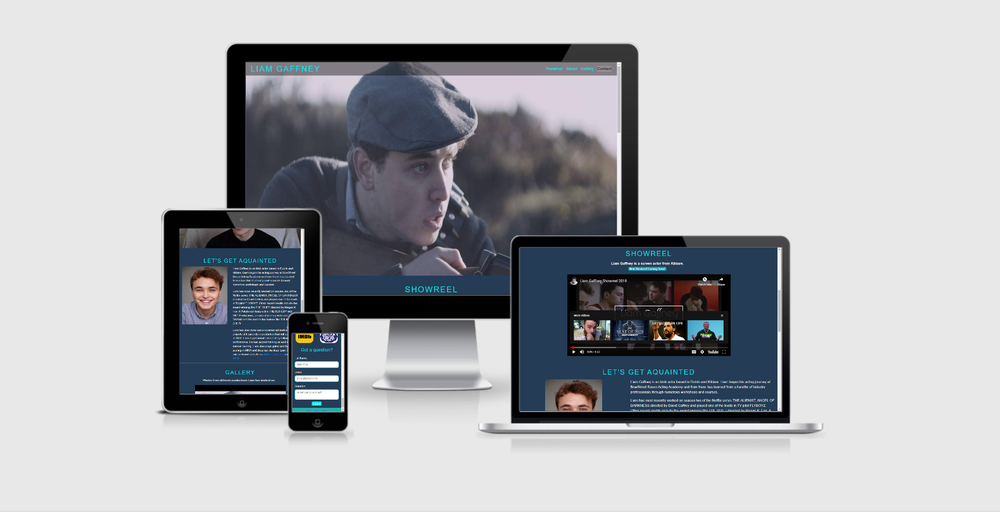
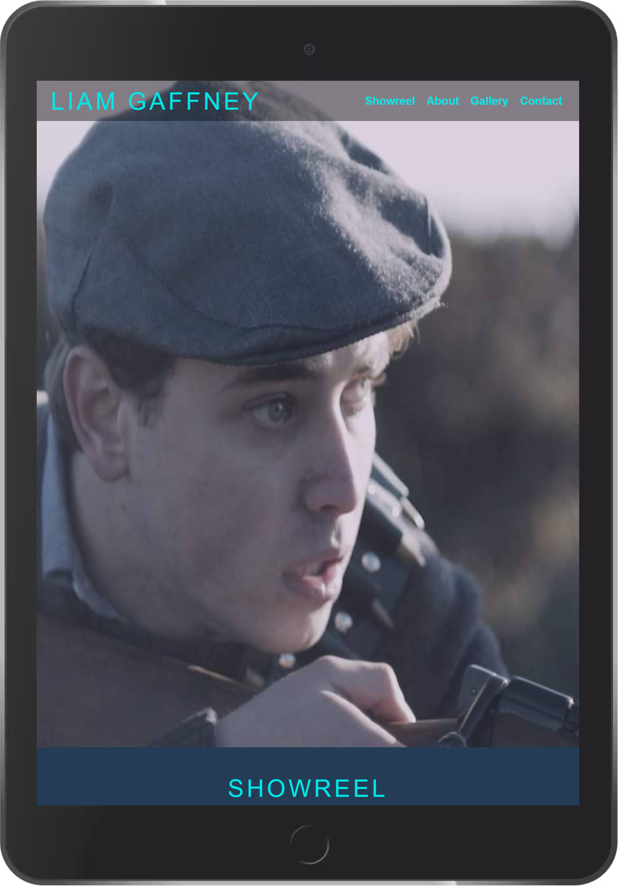
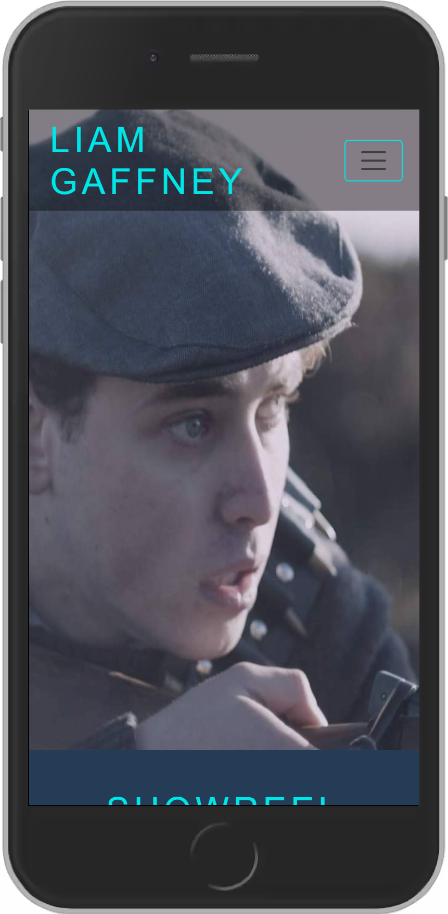
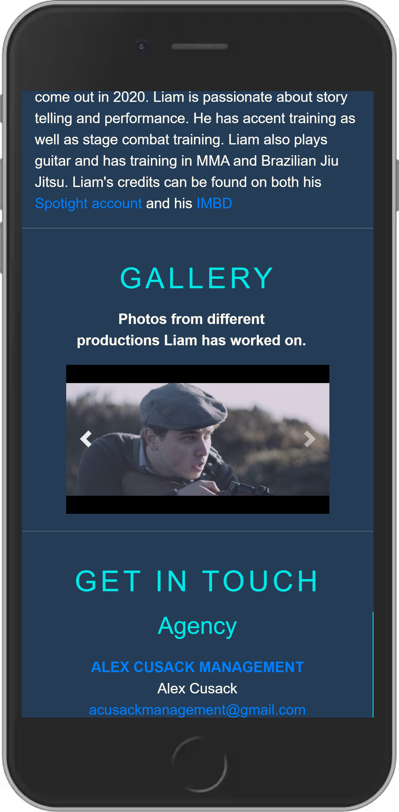

# Actor Webpage

I am designing this webpage as part of my MS1 project for Code Institute's Dimploma in Software Development. This will also be my own personal Actor's Webpage that has been designed to showcase my work and keep
people up to date with my career so far. I hope to use this webpage to market and advance my career.

# UX

## Users
The users that will visit my webpage are going to consist of other actors and casting agents. Because of this I didn't over populate my webpage with content, I kept it simple and only provided the necessary information.

When a casting agent visits a webpage they don't want to waist time so I aim to present them with an easy navigation system and coherently organised information.

Each section of the webpage conatains content to inform any user of who the actor is and of their previous work. It also provides user's a way of getting in contact with the actor and his agnecy should they want to work with the client.
Links to the actors other profiles(e.g spotlight, IMBD...) have also been added through out the webpage to validate the actors work experience.

The users will vary in ability and need so taking a simplictic approach to the webpage seemed to be the best course of action. The navigation is simple and makes it easy to find any information the user might be looking for.

The colours chosen for the webpage give it a retro and dramtic feel which suits the type of page we're creating. The combined colors also highlight all the content making it all visible and easy to read.
## User Stories
As a user I would like:

* To instantly have visual confirmation of what the actor looks like.
* To be able to view some of the actor's work.
* To be able to easily navigate through the actor's webpage.
* To read some basic information about the actors training and work history.
* To have access to the actors contact information for possible collaboration.
* To be able to contact the actor directly through the webpage.

## Design
  **Wire Frames**
  
  The webpage was designed using 
  Balsamiq to crate some basic 
  wireframes(Link below)
  
  [Wireframes](wireframes.md)

**Colours**

* I used a turquoise (#56c1c1) colour for all my headings as i felt it matched nicely with my hero image.

* The rest of the text was then either a simple shade of white or blue to blend nicely with the rest of the content and dark background.(I asked a number of people of all different ages if they could easily read the text with the chosen colours.)

**Typography**

* I used the "Goldman" font for all my heading as I felt it really made the the text stand out.
* I then used "Roboto-Condensed" for the rest of my text as it seemed to pair nicely with the Goldman and it came reccomended by [Google Fonts](https://fonts.google.com/).

**Backgrounds**

* The background for the header is a photo of the actor(me) and was chosen to instantly show off the actor in his working environment.
* The rest of the page was given a navy blue colour (#243c56). This made the rest of the content stand out to the user.

# Features
## Exsisting Features
* **Nav** - The webpage will have a responsive nav in the top right corner that will be linked to all the sections of the page. On small viewports the nav will change to burger icon conating the nav elements.

Drop down navigation menue for small screen sizes.

* **Showreel** - An iFrame element was used to embed a video from [YouTube](https://www.youtube.com/embed/6bVErQjUwtA) which showcases the actors work(this showreel is to be updated soon).

* **Gallery** - An interactive photo gallery in the form of a carousel was added to the webpage to conveniently display some shots of the actor at work.

* **Links** - Buttons and links that lead users to the actors other profiles, webpages and social media are dispersed through out the page.

* **Form** - A contact form to contact the actor directly through the webpage was added to the contact section.

## Features Still to Be Implemented
* An external page is to be added that will contain a blog to keep users up to date on the actors career.
* A section for the actor to upload new mnologues and scenes for users to view and comment on.

# Technologies Used
## Languages
* [HTML5](https://en.wikipedia.org/wiki/HTML5)
* [CSS3](https://en.wikipedia.org/wiki/CSS)

## Frameworks and Programs
* [Bootstrap 4.5](https://getbootstrap.com/docs/4.3/getting-started/introduction/)
>- Used to get the overall layout of the Webpage.

* [Balsamiq](https://balsamiq.com/wireframes/?gclid=Cj0KCQiA48j9BRC-ARIsAMQu3WSc14tIkeDZUlWDIVOa-Acbyn1s5XvsJJ6CnWplwD7_WPcgk-C4cTgaAsaNEALw_wcB)
>- I used Balsamiq to make my wireframes.

* [GitHub](https://github.com/)
>- GitHub was used to push content to the repository.

*  [TinyPNG](https://tinypng.com/)
>- TinyPNG was uses to compress my images and files.

*  [W3C CSS Validator](https://jigsaw.w3.org/css-validator/validator)
>- CSS code was checked using CSS W3C CSS Validator.

* [Online Beautifier](https://beautifier.io/)
>- Online Beautifier was used to beautify my HTML code.
# Testing
As the webpage was being built Chrome developer tools were used to ensure that the code was working smoothly. Each section was then tested agin every time a new feature was added.

Post-deployment the webpage was tested across a number of devices to ensure it remained responsive.

**Bugs**

Most bugs I encountered were solved through the use of Bootstrap or were simple mistakes that were easily fixed in my CSS code.

* Carousel 
> I originally encountered an issue with carousel that I got from Bootstrap, this was mainly to do with it's positioning . This problem was fixed using the flex utility from Bootstrap.
  Also the photos that were added to the gallery had to be adjusted to fit within the carousel.
* Gallery Section 
>After I corrected the carousel position it seemed that a new problem had arose. When viewing the site on a view port bigger than 720px the sections would collapse in on top of eachother. This problem was fixed by simply adjusting the height of all the sections

*  Nav 
> I had to return to my nav as it seemed that it would move out of place when i viewed the webpage on a mobile device. Once again this was fixed using the flex utility from Bootstrap.
(The nav toggler icon currently moves up and down when clicked on. I left this asit seems to work as a feature of the application.)

* [W3C Markup Validator](https://validator.w3.org/nu/#textarea)
>W3C Markup Validator was used to check the HTML code.

* Viewport Testing
> The webpage was opened on a number of different screen sizes to ensure it worked on all viewports. The webpage did run into trouble when opened on viewports with a width smaller than 400px as all the content is pushed slightly to the left. This was solved by removing the padding from from the video in the showreel section.

# Deployment
The site was deployed to GitHub pages. See below for instructions.

* Log on to GitHub repository.
* Click on settings.
* Scroll to GitHub pages.
* Change your source to Branch - Master.
* Hit save.
# Credits

## Code
* The interactive structure and layout of the code  https://getbootstrap.com/docs/4.5/layout/overview/
* Embeded youtube video copied from youtube
* Photo gallery carousel https://getbootstrap.com/docs/4.5/components/carousel/
* Resources such as W3schools and Stackover flow were used to come up with solutions to various problems I encountered
* Some ideas for the code (such as the social media links) were taken from mini projects done through out the course. 

## Acknowledgements
* I would also like to credit and thank my mentors Brian Macharia and Oluwasuen Owonikoko for all their help in guiding me through my firs milestone project.